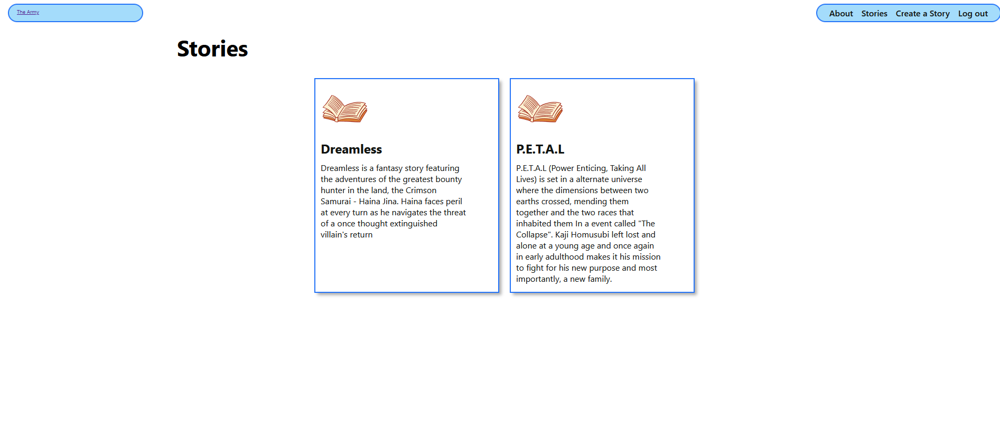

# Storybook corner

## Goal

I was unhappy with the final outcome of my original OC project, with the extra skills I learned I wanted to make one that had more user interaction and accomplished more of what I wanted it to be

## Deployed project

https://storybook-corner-0d2f626a4663.herokuapp.com/

The current version can be accessed with this link

## Technologies used
- Python
- HTML
- Django
- Whitenoise
- Heroku deployment

## Stretch Goals
- Figure out image uploading
- Allow character creation for users
- Enhance home page with more images
- An "Entrance" screen that plays before seeing the contents of the home screen